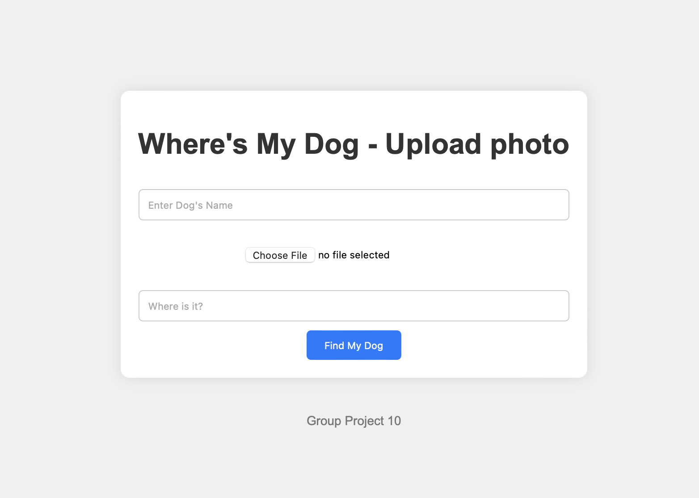
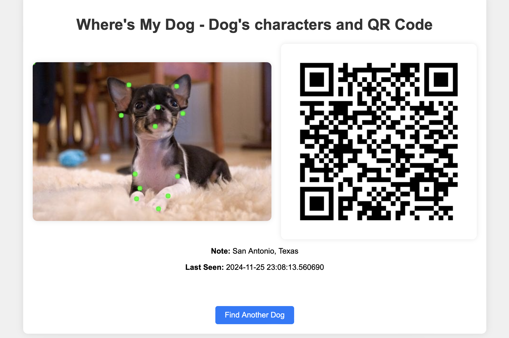

# Light-weighted dog finding server
## To train the model(STANFORD-DOG dataset is necessary)
	python train_model.py #bash
## To get started with the flask server
	python flask-backend.py #bash
## How to use this system?

### Fill the blanks with dog's information.
(usage/frontpage.png)

### Get the unified skeleton information & unified QR code of the dog.
